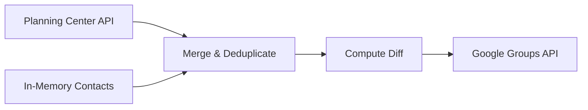

# 📇 Contacts Sync

A Symfony console application to sync contacts from Planning Center to Google Groups. The application queries both sources for lists named after distribution groups. It then diffs the contacts and makes sure the Google group mirrors the contacts found in Planning Center.



## 📦 Installation

All dependencies can be installed using the [Composer PHP dependency manager](https://getcomposer.org/). Once Composer is installed, [download this repository](https://github.com/nrutman/contacts-sync/releases) and run the following command:
```bash
composer install
```

## ⚙️ Configuration

Included in the `config` folder is a `parameters.yml.dist` file. Complete the following steps:
1. Copy this file and rename it `parameters.yml`.
2. Fill in all of the tokens with configuration for Planning Center and Google.
3. Make sure the `lists` parameter is completed with the lists to sync from Planning Center into Google Workspace.
4. Run `bin/console sync:configure` to get a Google Workspace token.

### Configuration Reference

| Parameter | Type | Description |
|-----------|------|-------------|
| `planning_center.app.id` | string | Planning Center API application ID |
| `planning_center.app.secret` | string | Planning Center API application secret |
| `google.authentication` | object | Google OAuth client configuration (client ID, secret, project ID, URIs) |
| `google.domain` | string | The Google Workspace domain (e.g. `example.com`) |
| `lists` | string[] | List names to sync — each name must match both a Planning Center list and a Google Group email |
| `contacts` | object | In-memory contacts to include in sync (see below) |

### In-Memory Contacts

The `contacts` parameter in `parameters.yml` allows you to manually add contacts that will be included in the sync even if they are not in Planning Center. This is useful for adding external members to distribution groups.

Each contact requires an `email` and a `list` (the destination Google Group). A contact can belong to multiple lists by providing an array:

```yaml
contacts:
    John Doe:
        email: john@external.com
        list: group@example.com
    Jane Doe:
        email: jane@external.com
        list:
            - group1@example.com
            - group2@example.com
```

In-memory contacts are merged with Planning Center contacts before the diff is computed. If the same email exists in both sources, it is included only once.

## 🚀 Usage

### `sync:configure`

To configure the command by provisioning a token with your Google Workspace user, run the following command:
```bash
bin/console sync:configure
```
The command will provide a Google authentication URL which will require you to login with a Google Workspace Groups administrator and paste the provided access token back to the command. If a valid token has already been provided, the command will exit gracefully.

| Parameter | Description |
| --------- | ----------- |
| --force   | Forces the command to overwrite an existing Google token. |

> **Note:** the resulting Google token is stored in the `var/google-token.json` file. If at any time you have problems with Google authentication, delete this file and rerun the `sync:configure` command (or use the `--force` parameter).

### `sync:run`

To sync contacts between lists, simply run the following command:
```bash
bin/console sync:run
```
This will fetch the lists, run a diff, and display information for changes it is making to the groups.

| Parameter | Description |
| --------- | ----------- |
| --dry-run | Computes the diff and outputs data without actually updating the groups. |

### `planning-center:refresh`

Refreshes a Planning Center list so it contains the most up-to-date contacts. Planning Center lists are computed on-demand, so running this command before a sync ensures the source data is current.

```bash
# Refresh a single list
bin/console planning-center:refresh list@example.com

# Refresh all configured lists
bin/console planning-center:refresh all
```

| Argument   | Description |
|------------|-------------|
| list-name  | The name of the list to refresh. Pass `all` to refresh all configured lists. |

## 🔧 Troubleshooting

| Problem | Solution |
|---------|----------|
| `The Google Client cannot authenticate with your account` | Run `bin/console sync:configure` to set up or refresh your Google token. |
| `The required Google token was not found` | The token file (`var/google-token.json`) is missing or invalid. Delete it and re-run `sync:configure`. |
| Google token keeps expiring | Ensure `setAccessType('offline')` is configured (default). Re-run `sync:configure --force` to get a new refresh token. |
| `The list 'X' could not be found` | The list name in `parameters.yml` does not match any Planning Center list. Verify the exact name in Planning Center. |
| `Unknown list specified: X` | The list name passed to `planning-center:refresh` is not in the configured `lists` parameter. Use `all` or a valid list name. |

## 📖 Technical Documentation

For architecture details, the sync algorithm, and developer guidance, see the [src/README.md](src/README.md). Each namespace within `src/` also contains its own README with implementation-specific documentation.