# 🔑 Google Client (`App\Client\Google`)

This namespace contains the Google Workspace integration layer, communicating with the [Google Admin Directory API](https://developers.google.com/admin-sdk/directory) to manage Google Group memberships.

## 🔄 OAuth Lifecycle

`GoogleClient::initialize()` handles the full OAuth lifecycle and must be called before any read/write operations:

```mermaid
flowchart TD
    A[initialize] --> B[Configure Google\Client\nscopes, credentials, offline access]
    B --> C[Load token from\nvar/google-token.json]
    C --> D{Token valid?}
    D -- Yes --> E[✅ Ready]
    D -- No --> F{Refresh token\navailable?}
    F -- Yes --> G[Refresh access token]
    G --> H[Persist updated token to disk]
    H --> E
    F -- No --> I[❌ Throw InvalidGoogleTokenException\nUser must run sync:configure]
```

The two required scopes are `ADMIN_DIRECTORY_GROUP` and `ADMIN_DIRECTORY_GROUP_MEMBER`. Access type is set to `offline` so that a refresh token is issued on initial authorization. The `select_account consent` prompt ensures the refresh token is always included.

## 💾 Token Storage

The OAuth token is stored as JSON at `var/google-token.json`. This file is read and written through `FileProvider` rather than direct filesystem calls, keeping I/O abstracted and testable.

If this file is deleted or becomes corrupt, the application will throw `InvalidGoogleTokenException` on the next run, and the user will need to re-authorize via `sync:configure --force`.