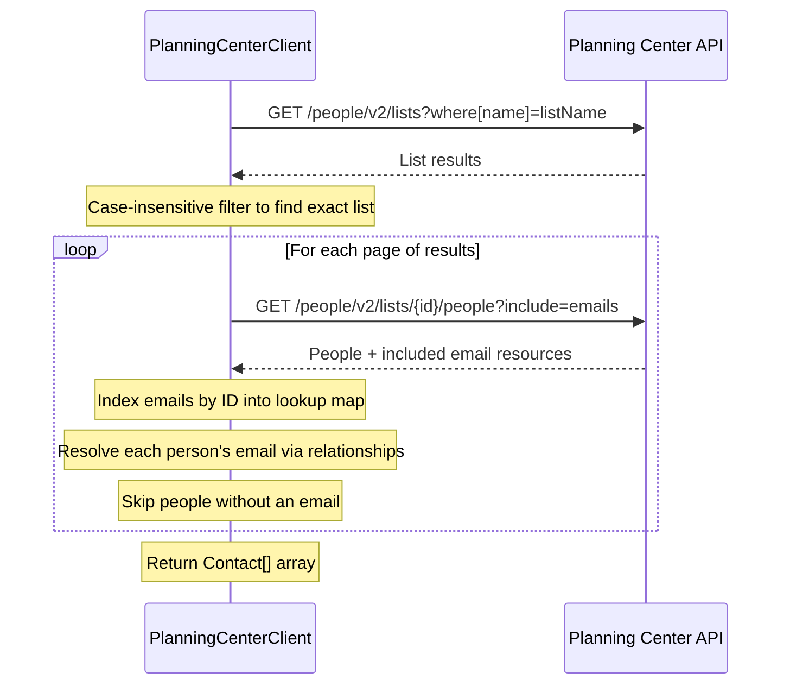

# 📡 Planning Center Client

This namespace contains the API client for reading contacts from [Planning Center](https://www.planningcenteronline.com/) lists via the [People API](https://developer.planning.center/docs/#/apps/people/).

## 🔍 Fetching Contacts

`getContacts(string $listName)` retrieves all contacts belonging to a named list through a multi-step process:

1. **Find the list** — queries `GET /people/v2/lists?where[name]=<listName>` and filters the results with a case-insensitive match to find the exact list.
2. **Fetch people with emails** — calls `GET /people/v2/lists/{id}/people?include=emails` to retrieve list members along with their associated email records via JSON:API `include`.
3. **Map emails** — the included email resources are indexed by ID into a lookup map, and each person's primary email is resolved through their `relationships.emails` data. People without an email are silently skipped.
4. **Paginate** — the People API returns paginated results with JSON:API-style `links.next` URLs. `queryPeopleApi()` follows these in a `do…while` loop, parsing the query string from each `next` URL and feeding it into the subsequent request until no `next` link is present.

## ♻️ Refreshing Lists

Planning Center lists are computed on-demand, so their membership may be stale. `refreshList()` triggers a server-side recomputation by looking up the list by name and then sending `POST /people/v2/lists/{id}/run`. This should typically be run before a sync to ensure source data is current.