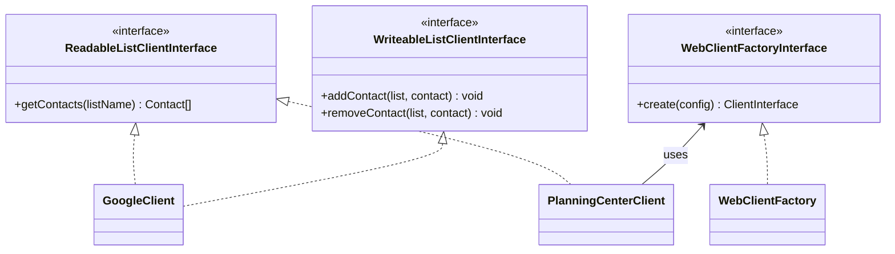

# 🔌 Client Namespace

The `App\Client` namespace defines the contracts and shared infrastructure for communicating with external list providers. Individual API implementations live in sub-namespaces.

## 🏗️ Design

Two interfaces separate read and write concerns: `ReadableListClientInterface` for fetching contacts from a list, and `WriteableListClientInterface` for modifying list membership. Both `GoogleClient` and `PlanningCenterClient` implement the readable interface, but only `GoogleClient` implements the writeable interface since Google Groups is the sole sync destination.

`WebClientFactory` provides a factory abstraction over Guzzle HTTP clients so that API clients can receive pre-configured HTTP clients without directly instantiating them — primarily to simplify testing. `PlanningCenterClient` uses this factory; `GoogleClient` does not because the Google SDK manages its own HTTP transport.