# 📊 Contact Namespace

The `App\Contact` namespace contains the domain model for contacts and the logic used to compare contact lists during a sync.

## ContactListAnalyzer

Computes the diff between a **source** list (Planning Center + in-memory contacts) and a **destination** list (Google Group). The diff determines which contacts need to be added to or removed from the destination.

### Algorithm

The analyzer performs a bidirectional comparison keyed on **lowercased email address**:

1. ➕ **Contacts to add** — present in the source list but missing from the destination list.
2. ➖ **Contacts to remove** — present in the destination list but missing from the source list.

Each direction is computed by `buildDiffArray()`, which indexes the comparison list into a hash map by lowercased email, then filters the reference list to find emails absent from that map. When `$removeDuplicates` is `true` (the default), duplicate emails within a single list are collapsed so each address appears at most once in the result.

### Example

```mermaid
graph LR
    subgraph Source ["☁️ Source (PC + In-Memory)"]
        A["alice@x.com"]
        B["bob@x.com"]
        C["carol@x.com"]
    end
    subgraph Destination ["📬 Destination (Google)"]
        A2["alice@x.com"]
        D["dave@x.com"]
    end
    subgraph Result ["📋 Diff Result"]
        ADD["➕ Add: bob, carol"]
        REM["➖ Remove: dave"]
    end
    Source --> Result
    Destination --> Result
```

## InMemoryContactManager

Provides manually-configured contacts defined in `config/parameters.yml` under the `contacts` key. These are merged with Planning Center contacts before the diff is computed, allowing external members to be included in Google Groups even if they aren't in Planning Center.

List names are normalized to lowercase during construction, so lookups are case-insensitive. A single contact can belong to multiple lists by providing an array for the `list` value. See the [configuration reference](../../readme.md#in-memory-contacts) for the YAML format.