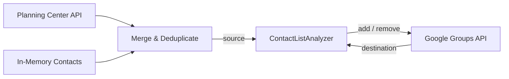
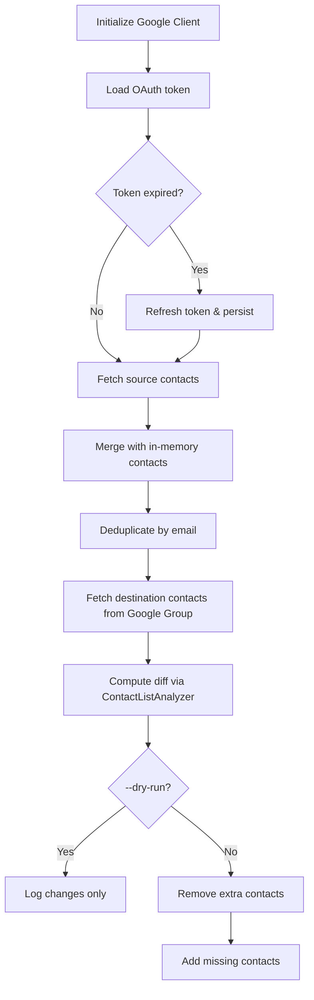

# 🧩 Source Code — Technical Overview

This document covers the architecture, internal design, and developer workflow for the Contacts Sync application. For installation, configuration, and usage instructions, see the [project README](../README.md).

## 🏗️ Architecture



The application follows a **source → diff → destination** pipeline. Source contacts are read from Planning Center and optionally supplemented with in-memory contacts defined in configuration. The merged source list is compared against the current members of a Google Group, and the resulting diff is applied to bring the Google Group in sync with the source.

## 📦 Namespaces

| Namespace | Description | Details |
|-----------|-------------|---------|
| `App\Client` | API client interfaces and implementations for reading/writing contact lists | [Client README](Client/README.md) |
| `App\Client\Google` | Google Workspace Directory API integration (OAuth, token management, group membership) | [Google README](Client/Google/README.md) |
| `App\Client\PlanningCenter` | Planning Center People API integration (list lookup, pagination, email resolution) | [PlanningCenter README](Client/PlanningCenter/README.md) |
| `App\Command` | Symfony console commands that orchestrate the sync workflow | [Command README](Command/README.md) |
| `App\Contact` | Contact domain model, list diffing, and in-memory contact management | [Contact README](Contact/README.md) |
| `App\File` | File I/O abstraction used for token storage | — |

## 🔄 Sync Algorithm

The `sync:run` command executes the following steps for **each configured list**:



1. **Initialize Google Client** — Loads the stored OAuth token from `var/google-token.json`, automatically refreshing it if expired.
2. **Fetch source contacts** — Queries the Planning Center People API for the list's members and merges them with any in-memory contacts configured for the same list. Contacts are deduplicated by email address during the merge.
3. **Fetch destination contacts** — Queries the Google Group (matched by name) for its current members.
4. **Compute diff** — `ContactListAnalyzer` compares the two lists by email (case-insensitive) to determine contacts to add and contacts to remove.
5. **Apply changes** — Removes extra contacts from the Google Group, then adds missing contacts. If `--dry-run` is set, changes are logged but not applied.

## 💉 Dependency Injection

The application uses the Symfony service container with autowiring. Service bindings are configured in `config/services.yaml` and map constructor parameter names to configuration values from `config/parameters.yml`:

| Constructor Parameter | Configuration Key |
|-----------------------|-------------------|
| `$googleConfiguration` | `google.authentication` |
| `$googleDomain` | `google.domain` |
| `$inMemoryContacts` | `contacts` |
| `$lists` | `lists` |
| `$planningCenterAppId` | `planning_center.app.id` |
| `$planningCenterAppSecret` | `planning_center.app.secret` |
| `$varPath` | `kernel.var_dir` |

All classes under `src/` are auto-registered as services (excluding `Kernel.php`).

## 📂 Project Structure

```
src/
├── Client/
│   ├── Google/
│   └── PlanningCenter/
├── Command/
├── Contact/
├── File/
└── Kernel.php
tests/                   # PHPUnit tests (mirrors src/ structure)
config/                  # Symfony configuration and parameters
```

## 🛠️ Developer Guide

### Prerequisites

- PHP 8.5+
- [Composer](https://getcomposer.org/)

### Running Tests

```bash
composer run-script test
```

Or directly via PHPUnit:

```bash
php vendor/bin/phpunit
```

Tests mirror the `src/` directory structure under `tests/`.

### Code Style

The project uses [PHP-CS-Fixer](https://github.com/FriendsOfPHP/PHP-CS-Fixer) for code formatting:

```bash
# Check for violations
composer run-script cs

# Auto-fix violations
composer run-script cs-fix
```
